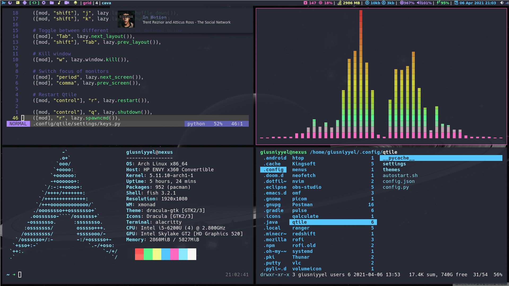

# Dotfiles & Arch Installation


# Tabla de contenido
- [Instalación de ArchLinux] (#instalación-de-archlinux)
- [Dotfiles] (#dotfiles)

# Instalación de ArchLinux
Se cambiará la distribución de teclado
`loadkeys la-latin1`

## Conexion a Internet
En este punto necesitamos de una conexión a Internet, para ello nos conectaremos mediante WIFI usando ***iwctl***, se nos abrirá el prompt de ***iwd***, ahí nos conectaremos usando los siguientes comandos:
```
# Para ver todos los dispositivos de red del ordenador.
device list

# Seleccionamos el dispositivo de red adecuado en este caso "wlan0" y escaneamos las redes cercanas.
station wlan0 scan

# Una vez escaneados los dispositivos, procedemos a mostrar las redes obtenidas.
station wlan0 get-networks

# Para conectarnos a la red deseada usamos el siguiente comando que nos pedirá ingresar la contraseña de la red.
station wlan0 connect [NombreRed]

# La consola no mostrará nada por lo que tendremos que comprobar que estamos conectados a la red, nos saldremos del iwd prompt.
exit

# Haremos un ping a la página oficial de ArchLinux
ping archlinux.org

# Para terminar el proceso usamos CTRL + C
```

## Sincronización del reloj
Una vez conectados a internet debemos sincronizar el reloj:
`timedatectl set-ntp true`

## Partición de Disco
Procedemos a realizar las particiones usando ***cfdisk***, con él vamos a crear las particiones para cada fichero.

### Partición EFI
La partición de EFI sólo dispondrá de **512M**, con un *[TYPE]* **EFI System**

### Partición Raíz
La partición Raíz es donde se instalará el sistema operativo y los programas que se vayan agregando. 
En este caso le asignaré **120G**, con un **[TYPE]** **Linux filesystem**

### Partición SWAP
La partición SWAP depende de la RAM que se tenga, se recomienda asignarle la mitad del tamaño de RAM,
sin embargo, si la PC tiene buenas especificaciones se recomienda asignarle de **512M** a **1G**. En este caso,
se le asignará **3G**, con un **[TYPE]** **Linux swap**

###### Partición Home
La partición Home es donde se crearán los directorios de los usuarios y se guardarán sus archivos. 
En este caso le asignaré los GB restantes **808G**, con un *[TYPE]* **Linux filesystem**

Una vez completado estos pasos, procedemos a guardar los cambios, dando en **[WRITE]**
y escribimos **yes**. Seleccionamos **[QUIT]** y regresaremos al prompt, limpiamos pantalla usando **clear**.

## Formato de las Particiones
Teniendo en cuenta las particiones creadas, usaremos su numero de dispositivo (/dev/sda***n***) para darle formato.
Mostramos la particiones actuales con: `fdisk -l`. Procedemos a dar formato a cada partición usando **mkfs**:

### Partición EFI
A EFI se le asignará el formato Fat32
`mkfs.vfat -F32 /dev/sda1`

### Partición Raíz
A la partición raíz se le asignará el formato Ext4
`mkfs.ext4 /dev/sda2`

### Partición SWAP
La partición SWAP necesita de formato y activación.

##### Formato SWAP
`mkswap /dev/sda3`

##### Activación SWAP
`swapon /dev/sda3`

### Partición Home
A la partición Home se le asignará el formato Ext4
`mkfs.ext4 /dev/sda4`

## Montando Particiones
Una vez dado el formato procedemos a montar las particiones, a como se muestra a continuación:

### Partición Raíz
Primero montaremos la partición raíz
`mount /dev/sda2 /mnt`

Antes de montar la EFI y Home crearemos sus directorios.
```
# Directorio Home
mkdir /mnt/home

# Directorio EFI
mkdir -p /mnt/boot/efi
```

### Partición EFI
`mount /dev/sda1 /mnt/boot/efi`

### Partición Home
`mount /dev/sda4 /mnt/home`

## Instalación del Sistema Base
Antes de instalar los siguientes paquetes deberías conocer para que sirve cada uno.

#### Sistema base
Instala el sistema base de Archlinux, estos paquetes contienen todo lo necesario junto a sus dependencias para instalar Archlinux.
`base base-devel`

#### Paquete GRUB
GRUB es un gestor de arranque.
`grub`

#### Paquete os-prober
Este paquete detectará otros sistemas operativos en el disco duro.
`os-prober`

#### Paquete ntfs-3g
Es un controlador estable de NTFS para Linux.
`ntfs-3g`

#### Paquete networkmanager
Networkmanager permite a los sistemas la detección y configuración automática para conectarse a la red.
`networkmanager`

#### Paquete efibootmgr
Efibootmgr es necesario para EFI.
`efibootmgr`

#### Paquete gvfs, gvfs-afc y gvfs-mtp
```
gvfs	# sirve para montar USB, MicroSD y demás particiones del disco.
gvfsafc	# sirve para montar un iphone
gvfs-mtp	# para montar un android
```

#### Paquete xdg-users-dirs
Este paquete crea las carpetas por defecto del usuario de forma automática.

### Instalación de los paquetes
Ya que tenemos en cuenta los paquetes que vamos a instalar, usaremos ***pacstrap*** un gestor que nos ayudará a instalar el sistema base de ArchLinux.
```
# La descarga de estos paquete dependerá de tu internet.
pacstrap /mnt base base-devel efibootmgr os-prober ntfs-3g networkmanager grub gvfs gvfs-afc gvfs-mtp xdg-user-dirs linux linux-firmware nano dhcpcd
```

### Paquetes adicionales
```
# WIFI (laptop)
pacstrap /mnt netctl wpa_supplicant dialog

# TOUCHPAD (en caso de tener)
pacstrap /mnt xf86-input-synaptics
```

## Generar fstab
Hay que generar el archivo fstab que contendrá la tabla de particiones del sistema.
`genfstab -pU /mnt >> /mnt/etc/fstab`

Una vez realizado lo anterior, podemos entrar al sistema.
`arch-chroot /mnt`

## Configurar el sistema base

### Hostname
**Hostname** es el nombre único del ordenador en la red. Para crearlo usamos.
`echo NombreHost > /etc/hostname`

### HOST
***HOST*** es el archivo donde se guardan las entradas de la red.
```
# Modificamos el archivo
nano /etc/hosts

# En el archivo ponemos lo siguiente:
127.0.0.1	localhost
::1		localhost
127.0.1.1	myhostname.localhost	myhostname
```

### Zona horaria
Tambien hay que establecer nuestra zona horaria (en este caso es México City).
`ln -sf /usr/share/zoneinfo/America/Mexico_City /etc/localtime`

### Idioma del sistema
El idioma principal de nuestro sistema operativo habrá que asignarlo para ello haremos uso de **nano** para editar el archivo ***locale.gen***.
`nano /etc/locale.gen`

En el archivo descomentaremos en el que nos convenga, es este caso ***es_MX.UTF-8 UTF-8***. Una vez guardados los cambios habrá que establecer las preferencias de localización.
`echo LANG=es_MX.UTF-8 > /etc/locale.conf`

Por último generamos el archivo locale.gen.
`locale-gen`

### Reloj de hardware
Configuraremos el reloj del sistema, para que cuando el sistema inicie lea el reloj interno.
`hwclock -w`

### Distribución de teclado
Para que nuestra distribución de teclado se guarde y no necesitemos colocarla a cada rato configuraremos el archivo.
`echo KEYMAP=la-latin1 > /etc/vconsole.conf`

### GRUB
Ahora hay que configurar ***GRUB***, para ello usaremos:
```
# Añadimos nuestro sistema a GRUB
grub-install --efi-directory=/boot/efi --bootloader-id='Arch Linux' --target=x86_64-efi

# Procedemos a crear el archivo grub.cfg
grub-mkconfig -o /boot/grub/grub.cfg

# Para comprobar por otros sistemas usaremos
os-prober

# Procedemos a recrear el archivo grub.cfg
grub-mkconfig -o /boot/grub/grub.cfg
```

### Contraseña Root
Hay que establecer una contraseña para root.
`passwd`

### Crear un usuario
Creamos el usuario con los permisos correspondientes.
`useradd -m -g users -G audio,lp,optical,storage,video,wheel,games,power,scanner -s /bin/bash tu_usuario`

### Contraseña usuario
Configuramos la contraseña del usuario agregado.
`passwd usuarionombre`

### Activar grupo WHEEL
Antes de salir, dejaremos activado el grupo wheel dentro de los sudoers.
`nano /etc/sudoers`

### Salir del chroot
Terminando de configurar todo, procedemos a salir del chroot.
`exit`

## Desmontar particiones
Las particiones deben ser desmontadas, para ello se debe seguir el siguiente orden:
1. ***/boot/efi***
2. ***/home***
3. ***/***

### /boot/efi
umount /mnt/boot/efi

### /home
umount /mnt/home

### /
umount /mnt

### REINICIO DEL SISTEMA
Para terminar, procedemos a reiniciar el sistema.
`reboot`

## Primer Inicio
Una vez que hayamos reiniciado el sistema, iniciará nuestra distribución ya instalada,
iniciaremos sesión en el usuario **root**.

### NetworkManager
Hay que iniciar y activar NetworkManager.
```
# Inicializarlo
systemctl start NetworkManager.service

#Habilitarlo
systemctl enable NetworkManager.service
```

### Login Usuario
Ahora ya podemos empezar a configurar nuestro entorno arch, para ello, saldremos usando ***exit*** e iniciaremos sesión en
nuestro usuario personal.

**Conexión a Internet**
Para configurar la red a la que se conectará el ordenador.
`sudo nmcli dev wifi connect SSID password contraseña`

**Actualización del sistema**
Hay que tener actualizado el sistema.
`sudo pacman -Syyu`

**Complementos gráficos básicos**
Instalaremos para poder tener gráficos (iconos, fondos, ventanas, etc.).
`sudo pacman -S xorg`

Para gráficos avanzados (openGL, OpenMax, VA, etc.) utilizaremos mesa
`sudo pacman -S mesa mesa-demos`

**Controlador de vídeo**
Para identificar nuestra tarjeta gráfica.
`lspci | grep VGA`

Ya que tengamos eso podemos instalar los drivers según el fabricante.
***AMD***
`sudo pacman -S xf86-video-amdgpu amd-ucode`

***Nvidia***
`sudo pacman -S xf86-video-nouveau`

***Intel***
`sudo pacman -S xf86-video-intel intel-ucode`

***Terminal***
Para la terminal, en mi caso usaré alacritty, sin embargo, tambien instalaré xterm ya que es la terminal por defecto en Xmonad (Gestor de ventanas).
`sudo pacman -S alacritty xterm`

***GIT***
Primero instalaremos git, que es un software de control de versiones.
`sudo pacman -S git`

***Paquetes AUR***
Para poder instalar paquetes AUR necesitamos un gestor de paquetes AUR, en mi caso usaré YAY.
```
# Nos movemos al fichero opt
cd /opt/

# Clonamos el repositorio YAY
sudo git clone https://aur.archlinux.org/yay-git

# Cambiamos los permiso del repositorio descargado
sudo chown -R username:group ./yay-git

# Accedemos al repositorio y lo compilamos
cd yay-git
makepkg -si
```

## Paquetes esenciales
Llegados a este punto podemos instalar los paquetes que deseemos, nuestro entorno Arch ya es funcional.

### CCAT y EXA
En mi caso, instalaré ccat y exa, comandos con mejor diseño que cat y ls.
`sudo pacman -S exa`

Con ccat hay un problema y es que al usar yay, ccat no compila, por lo tanto habrá que descargarlo directamente.
```
# Instalamos wget (en caso de no tenerlo)
sudo pacman -S wget

# Descargamos el fichero
wget https://github.com/jingweno/ccat/releases/download/v1.1.0/linux-amd64-1.1.0.tar.gz

# Extraemos el fichero
tar xfz linux-amd64-1.1.0.tar.gz

# Copiamos ccat al system path
cp linux-amd64-1.1.0/ccat /usr/local/bin/

# Modificamos los permisos de ccat
chmod +x /usr/local/bin/ccat
```

### Audio
`sudo pacman -S pulseaudio pavucontrol pamixer`

### Brillo
`sudo pacman -S brightnessctl`

### Monitores
`sudo pacman -S arandr`

### Almacenamiento
`sudo pacman -S udiskie ntfs-3g`

### Red
`sudo pacman -S network-manager-applet`

### Systray
`sudo pacman -S volumeicon cbatticon`

### Notifications
```
# Instalación
sudo pacman -S libnotify notification-daemon

# Crea este archivo con nano o vim
sudo nano /usr/share/dbus-1/services/org.freedesktop.Notifications.service

# Copiar estas líneas en el archivo
[D-BUS Service]
Name=org.freedesktop.Notifications
Exec=/usr/lib/notification-daemon-1.0/notification-daemo
```

### Xprofile
```
# Instalamos Xorg-xinit
sudo pacman -S xorg-xinit

# Creamos el archivo .xprofile (donde irán los comandos que ejecutará al iniciar el sistema)
touch ~/.xprofile

# Copiar estas líneas en el archivo
xrandr --output eDP-1 --primary --mode 1920x1080 --pos 0x1080 --output HDMI-1 --mode 1920x1080 --pos 0x0 &
setxkbmap es &
nm-applet &
udiskie -t &
volumeicon &
cbatticon &
```

### File Manager
`sudo pacman -S thunar ranger`

### Trash
`sudo pacman -S glib2 gvfs`

### GTK Theming
`sudo pacman -S xcb-util-cursor lxappearance picom kvantum-qt5`

### Tipografías
Instalaremos algunas tipografías que pueden ser útiles.
`sudo pacman -S noto-fonts ttf-dejavu ttf-liberation ttf-bitstream-vera`

En los repositorios AUR tenemos otras tipografías más.
`yay -S ttf-ms-fonts nerd-fonts-ubuntu-mono nerd-fonts-fira-code ttf-firacode nerd-fonts-hack`

### Navegador Web
Para poder navegar por la web necesitamos un navegador, en este caso usaré firefox-developer-edition y brave
```
# Instalamos firefox
sudo pacman -S firefox-developer-edition

#Instalamos Brave
yay -S brave-bin
```

### Multimedia
Para reproducir contenido multimedia usaré VLC
```
#Instalamos VLC
sudo pacman -S vlc
```

### Edición Multimedia
En mi caso, editaré vídeos en mi entorno arch, por lo que necesitaré un editor, en este caso KdenLive
`sudo pacman -S kdenlive`

Para la edición de imágenes usaré Gimp
`sudo pacman -S gimp`

### Documentos
Para los documentos usaré la paquetería de WPS Office, ya que interpreta los documentos de Microsoft Office de la mejor manera.
`yay -S wps-office`

### Bluetooth
Para el bluetooth usaremos los siguientes paquetes.
```
sudo pacman -S bluez blueman

# Habilitaremos el servicio
sudo systemctl enable bluetooth.service
sudo systemctl restart bluetooth.service
```

##### Wallpaper
`sudo pacman -S feh`

# Logueo y Window Manager 
```
# Instalamos lo requerido para nuestro logueo (lightdm) y manejar las ventanas (instalaré xmonad y qtile)
sudo pacman -S lightdm lightdm-gtk-greeter lightdm-webkit2-greeter qtile xmonad xmonad-contrib xmobar trayer xdotool pacman-contrib upower rofi

# Instalamos el tema de lightdm desde los repos AUR
yay -S lightdm-webkit-theme-aether

# /etc/lightdm/lightdm.conf
[Seat:*]
# ...
# Uncomment this line and set this value
greeter-session = lightdm-webkit2-greeter
# ...

# /etc/lightdm/lightdm-webkit2-greeter.conf
[greeter]
# ...
webkit_theme = lightdm-webkit-theme-aether
```

Habilitamos el servicio de lightdm
```
# Habilitamos el servicio
sudo systemctl enable lightdm

# Reiniciamos el sistema
reboot
```

# Dotfiles
Antes de instalar estos dotfiles es necesario instalar GNU Stow, ya que permitirá instalar los dotfiles en unos cuantos pasos.
`sudo pacman -S stow`

Ya que tengamos GNU Stow instalado, procedemos a clonar el repositorio:
```
# Clonamos el repositorio en el home
git clone https://github.com/giusniyyel/.dotfiles

# Para obtener la configuración de los dotfiles en nuestro sistema hacemos uso del siguiente comando (recuerda cambiar la palabra paquete por el que desees):
stow --adopt -vt ~ paquete

# Recuerda recompilar xmonad (en caso de instalar xmonad), despues de hacer uso de los dotfiles.
xmonad --recompile

# Guardar este archivo en $HOME
https://raw.githubusercontent.com/git/git/master/contrib/completion/git-prompt.sh
```

# PYTHON
`sudo pacman -S python python2 python-pip`

# RUBY
```
# Instalamos ruby
sudo pacman -S ruby

# Instalamos ruby para neovim
gem install neovim
```

# NPM
```
# Instalamos npm
sudo pacman -S nodejs npm

# Instalamos la extension para neovim
npm install -g neovim
```

# VIM
```
# Instalamos neovim, vim y su extension de python, junto con xclip y tmux que son complementos para este
sudo pacman -S neovim vim tmux xclip python-pynvim

# Instalamos la extensión para neovim de python
sudo pip install neovim

# Instalamos el gestor de plugins de vim
https://github.com/junegunn/vim-plug

# Si ya se copiaron los dotfiles, puedes entrar a vim/neovim y usar (Para instalar los plugins)
:PlugInstall
```

# ZSH & Oh my zsh
```
sudo pacman -S zsh

# Cambiamos de interprete
chsh -s $(which zsh)

# Instalamos omz
https://github.com/ohmyzsh/ohmyzsh/wiki
```

# FISH
```
#Instalación de fish
sudo pacman -S fish

# Instalamos Oh my fish
https://github.com/oh-my-fish/oh-my-fish

# Instalamos starship theme
https://github.com/starship/starship
```
